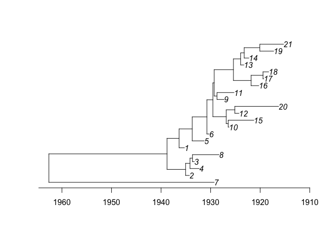
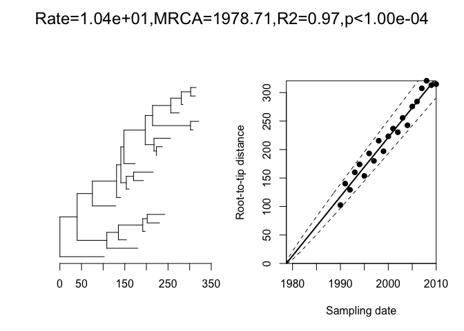
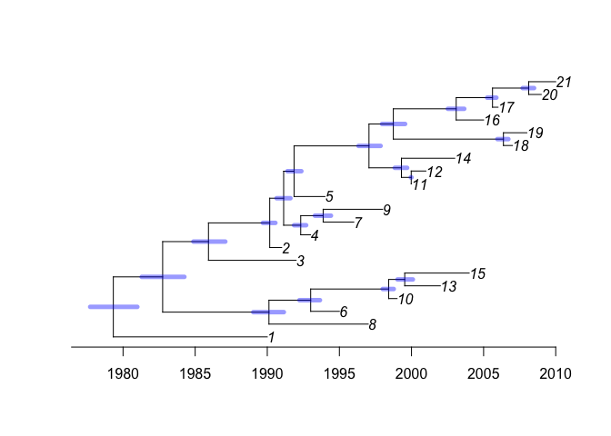

<!-- README.md is generated from README.Rmd. Please edit that file -->
CreDating
=========

The goal of CreDating is to perform Bayesian dating of the nodes of phylogenetic tree. This typically involves simultaneous Bayesian estimation of the molecular clock rate and coalescent rate. Additional features include inference of root location, lost sampling dates and different evolutionary models.

Installation
------------

You can install CreDating from github with:

``` r
devtools::install_github("xavierdidelot/CreDating")
```

The package can then be loaded using:

``` r
library(CreDating)
```

Example
-------

This is a basic example of usage. First we generate a coalescent tree with a single leaf per year between 1990 and 2010:

``` r
tree=simcoaltree(1990:2010)
plot(tree)
axisPhylo()
```



Next we generate an observed phylogeny based on this timed tree, and perform a root-to-tip analysis:

``` r
obsphy=simobsphy(tree)
r=roottotip(obsphy,1990:2010)
```

 We can run the dating analysis on this phylogeny as follows:

``` r
res=credate(obsphy,1990:2010)
plot(res,'treeCI')
```

 \#\# More information and getting help

For more detailed examples of how to use CreDating, see the vignettes [here](https://github.com/xavierdidelot/CreDating/tree/master/vignettes). See also the help included in the package using the R command `help(package='CreDating')`.

If you have any problem or question please create an issue [here](https://github.com/xavierdidelot/CreDating/issues) or get in touch by emailing `xavier.didelot@gmail.com`
