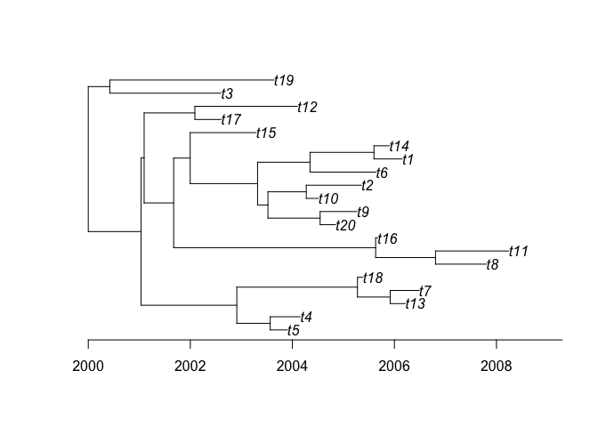
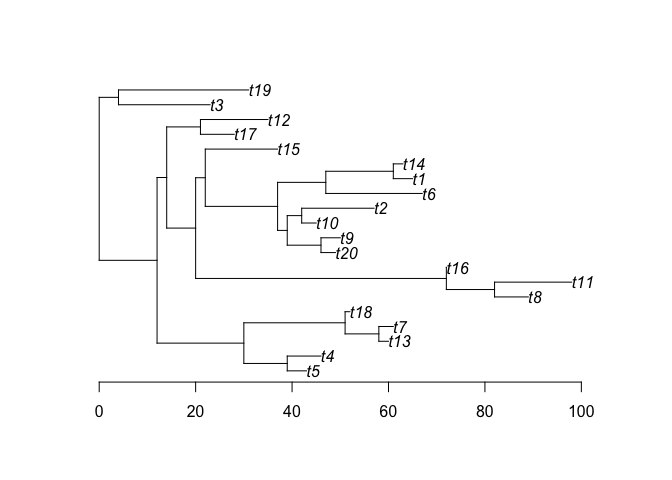

Example of using CreDating
================
Xavier Didelot
2017-09-23

Initialisation
--------------

``` r
library(CreDating)
library(ape)
set.seed(0)
```

Data
----

We consider a random timed tree with 20 leaves, with the root in 2000.

``` r
nsam <- 20
phy <- rtree(nsam, br = rexp)
plot(phy)
axisPhylo(root.time = 2000,backward = F)
```



We can compute the age of the leaves.

``` r
dates=rep(2000,nsam)
  for (i in 1:nsam) {
    w=i
    while (1) {
      r=which(phy$edge[,2]==w)
      if (length(r)==0) break
      dates[i]=dates[i]+phy$edge.length[r]
      w=phy$edge[r,1]
    }
  }
```

On each branch we observe a number of substitutions which is distributed *P**o**i**s**s**o**n*(*r**l*) where *l* is the branch length and *r* = 10 per year is the real substitution rate.

``` r
obsphy=phy
obsphy$edge.length=unlist(lapply(obsphy$edge.length*10,function (x) rpois(1,x)))
plot(obsphy)
axisPhylo(backward = F)
```



``` r
res=credating(obsphy,dates)
```
